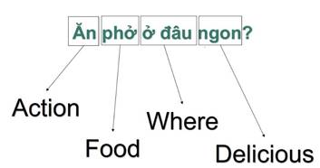
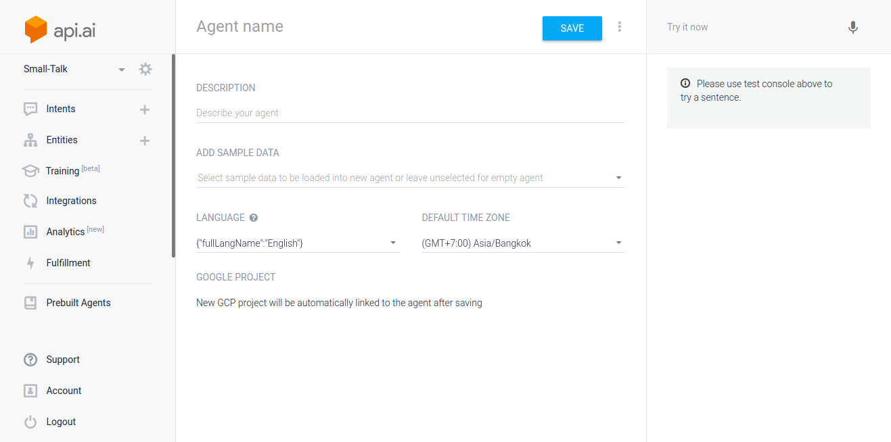
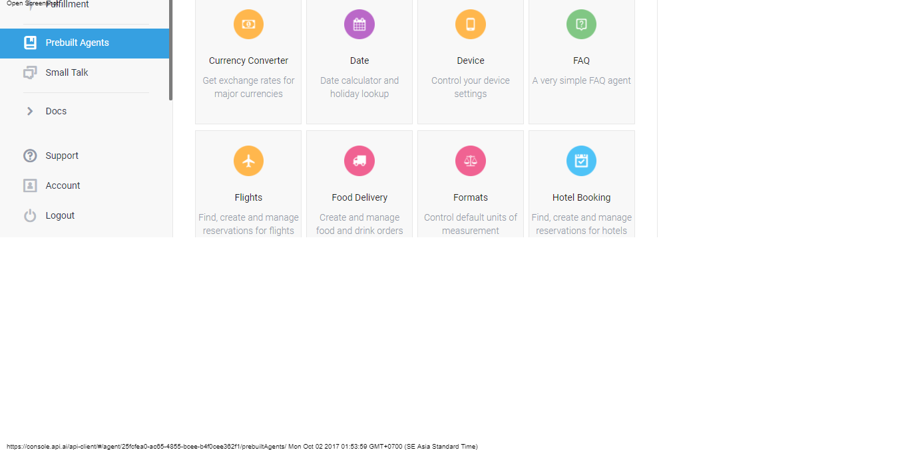

#HSLIDE

### AI, NLP in chatbot
<!-- #### các vấn đề hiện đại trong công nghệ thông tin -->

Nhóm 10

---

### API.AI

  - Api.ai là một framework hỗ trợ xử lý ngôn ngữ tự nhiên nhằm hỗ trợ người lập trình xây dựng một công cụ liên quan đến giao tiếp tự động giữa người và máy tính.
  - Api.ai’s Speech Recognition
  - Natural Language Understanding and Conversation Management

---

### Natural Language Processing

<ol>
<li class="fragment" data-fragment-index="1">Lexical Category – Nhóm từ vựng học</li>
<li class="fragment" data-fragment-index="2">Pattern – cú pháp hay ngữ pháp hình thành trong một câu</li>
<li class="fragment" data-fragment-index="3">Intent – xác định ý định, hay mục đích của câu được phân tích dựa trên ngữ cảnh giao tiếp.</li>
</ol>

---

### Lexical Category

- Nhóm từ vựng học
- Khái niệm này giúp định danh cho một tập các từ hoặc cụm từ cùng mang một ý nghĩa hay đề cập đến một nội dung cụ thể.
- Ví du: Food là một Lexical Category bao gồm các từ như bún bò, hủ tiếu, …

+++

### Example

Câu hỏi trên được phân tích thành các Lexical Category như sau

+++

### Example

- § Action: dùng để chỉ các hành động của con người có liên quan tới thức ăn.
- § Food: dùng để chỉ các món ăn.
- § Where: dùng để xác định các từ để hỏi địa điểm.
- § Delicious: là tập hợp các từ chỉ độ ngon của thức ăn.
- § …: các lexical category khác tùy theo sự phức tạp của của một câu được phân tích

Từ câu ví dụ trên chúng ta có thể gom lại thành một chuỗi các Lexical Category như sau:
#### [Action][Food][Where][Delicious]

---

### Pattern

  - cú pháp hay ngữ pháp hình thành trong một câu
  - Vi dụ:  [Action][Food][Where][Delicious].
  - Mục đích của pattern giúp xác định mẫu câu được dùng trong giao tiếp.

---

### Intent
  - xác định ý định, hay mục đích của câu được phân tích dựa trên ngữ cảnh giao tiếp.
  - Ví dụ:  với câu hỏi “Ăn phở ở đâu ngon?”, chúng ta hiểu intent “câu nói mong muốn xác định vị trí quán phở ở đâu là ngon”.

---

### API.AI 's basic concept

Khái niệm | Mô tả
------------ | -------------
Agent | Tương đương như một ứng dụng trong api.ai. Đây cũng là nơi chúng ta tích hợp vào ứng dụng của mình để có thể dạy và test bot.
Entity | Khái niệm tương tự như Lexical Category đã nói trên.
Intent | Xác định ngữ cảnh của câu và ứng xử trong giao tiếp. Có ý nghĩa tương tự như phần giải thích về intent trên

+++

Khái niệm | Mô tả
------------ | -------------
Action | Khi một intent được trigger thì action sẽ được thực hiện. Action đỏi hỏi các thông tin (parameter) tương ứng được tổng hợp từ các pattern kết hợp với các intent.
Context | Xác định ngữ cảnh của câu được phân tích hay giao tiếp. Context bao gồm các intent, cho biết các câu nói đó thuộc những ngữ cảnh tương ứng để có cách ứng xử cho phù hợp.

+++

### How to use?

  - REST API
  - Webhook

---

### Guide

---

#### Create Agent

+++

#### Guide

+++?gist=494e0fecaf0d6a2aa2acadfb8eb9d6e8

---

#### SAMBA Deployment Architecture

---

#### Some Related Links

- [GitHub: SAMBA Package](https://github.com/onetapbeyond/lambda-spark-executor)
- [GitHub: SAMBA Examples](https://github.com/onetapbeyond/lambda-spark-executor#samba-examples)
- [GitHub: aws-gateway-executor](https://github.com/onetapbeyond/aws-gateway-executor)
- [GitHub: Apache Spark](https://github.com/apache/spark)
- [Apache Spark Packages](https://spark-packages.org/package/onetapbeyond/lambda-spark-executor)
